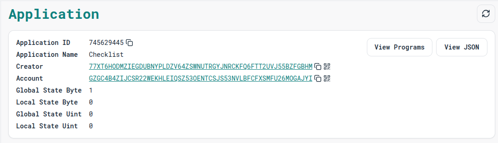

# Checklist dApp — Algorand (Simple Stateful Contract)

**One-line:** A minimal Algorand stateful smart contract that maintains a global `task` status and exposes `markDone` and `reset` methods.

---

## Table of contents

* [Project Description](#project-description)
* [What it does](#what-it-does)
* [Features](#features)
* [Deployed Smart Contract Link](#deployed-smart-contract-link)
* [Screenshot](#screenshot)
* [Contract interface & quick explanation](#contract-interface--quick-explanation)
* [How to call the contract (example)](#how-to-call-the-contract-example)
* [Limitations & suggested improvements](#limitations--suggested-improvements)
* [Development / Local testing (quick start)](#development--local-testing-quick-start)
* [Contributing](#contributing)
* [License](#license)

---

## Project Description

This project demonstrates a **beginner-friendly stateful Algorand smart contract** (written using the `@algorandfoundation/algorand-typescript` style) that provides two simple task-tracking operations:

* **markDone**: Sets the status of a global task to "done".
* **reset**: Resets the task status back to "pending".

It’s intentionally minimal, to help you understand how to:

* Define and update global state with string values.
* Write simple contract methods to change that state.
* Interact with a contract from a script or frontend.

---

## What it does

* Exposes two methods:
  * `markDone()` → Sets the global `task` state to `"done"`.
  * `reset()` → Sets the global `task` state back to `"pending"`.
* Global state stores a single string key: `task`.
* Returns the updated task status after each operation.

**Typical workflow:**

1. The contract starts with the `task` state as "pending".
2. A user calls `markDone()` → the `task` state changes to "done".
3. A user calls `reset()` → the `task` state changes back to "pending".
4. The global state `task` can be queried by any client to see the current status.

---

## Features

* Minimal, easy-to-follow stateful Algorand smart contract.
* Implements simple state-change logic (`pending` ↔ `done`).
* Global state tracks a single `task` status string.
* Beginner-friendly structure for extending into larger to-do list or workflow dApps.

---

## Deployed Smart Contract Link

🚀 [**https://lora.algokit.io/testnet/application/745629445**](https://lora.algokit.io/testnet/application/745629445)

(Contract Application ID: `745629445`)

---

## Screenshot

_(Add a screenshot of the dApp interface or a transaction explorer view here)_



---

## Contract interface & quick explanation

Here’s the Checklist contract code:

```ts
import { Contract, GlobalState } from '@algorandfoundation/algorand-typescript'

export class Checklist extends Contract {
  task = GlobalState<string>({ key: "task", initialValue: "pending" })

  markDone(): string {
    this.task.value = "done"
    return this.task.value
  }

  reset(): string {
    this.task.value = "pending"
    return this.task.value
  }
}
````

-----

## How to call the contract (example)

You can call the contract's methods using various tools like the AlgoKit CLI, Goal, or any Algorand SDK.

**Using AlgoKit CLI:**

```bash
# Mark the task as done
algokit call testnet-app-745629445 markDone

# Reset the task to pending
algokit call testnet-app-745629445 reset
```

-----

## Limitations & suggested improvements

This is a very basic example with some clear limitations:

  * **Single Global Task:** It only tracks one task for everyone.
  * **No Customization:** The task itself isn't defined, only its state.

**Suggested Improvements:**

  * **User-Specific Tasks:** Use Local State (`LocalState<string>`) to allow each user account to have their own task status.
  * **Multiple Tasks:** Expand the contract to manage a list of tasks, perhaps by serializing an array into a global state value or using multiple state keys.
  * **Custom Task Names:** Add a method that allows a user to set the text of the task, e.g., `createTask(name: string)`.

-----

## Development / Local testing (quick start)

1.  **Clone the repository.**
2.  **Install dependencies:** `npm install`
3.  **Run tests:** `npm test`
4.  **Deploy (using AlgoKit):** `algokit deploy`

-----

## Contributing

Contributions are welcome\! Please feel free to submit a pull request or open an issue.

-----

## License

This project is licensed under the MIT License.

```
```
